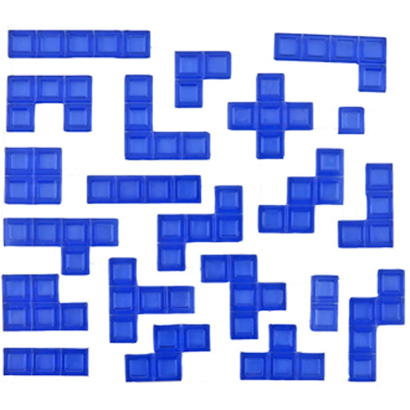

# Squakus

## Origins of Squakus
Squakus began in a class structured around mathematical games. During our time in that course, we became interested in the possibilities
surrounding polyominoes. We first played a game called Blokus that leverages polyominoes up to n = 5. 
Here are the Blokus pieces for one player:

  

Playing this game, we found immense curiosity in excentricies of each polyomino piece. We felt like we can leverage the unique shape of each piece to create a fast paced pattern matching game.

## Creating the gameplay loop
We initially raced each other to see who can make rectangles of varying dimensions first. This was fun, however the shapes where not particularly interesting and they did not leverage each polyomino to its fullest. The next issue we found was that someone who is more inclined to pattern matching and spatial reasoning would win almost every round. We needed to find a way for the game to scale as it progresses, giving other players a competitive advantage over the leader.

### Problem 1: Shape Generation

### Problem 2: Difficulty Scaling
To scale difficulty, we played around with mechanics like time advantages, shape variability by player, piece trading, and others. However, with each of these mechanics, we still were unable to create a clear progression of the game and a definite winning state.

To combat this, we went back to the initial cultivation of the game, namely simple rectangles. We tested a mechanic where a player who wins a round (e.i. creates the shape with their alloted polyominoes the fastest) must sacrifice a piece to their winning square. The winning square is a 5x5 square that only accepts a piece when the player has won a round. The game is won by a player when they have fully filled their winning square.

## Creating the Board

## Transferring to Electronics